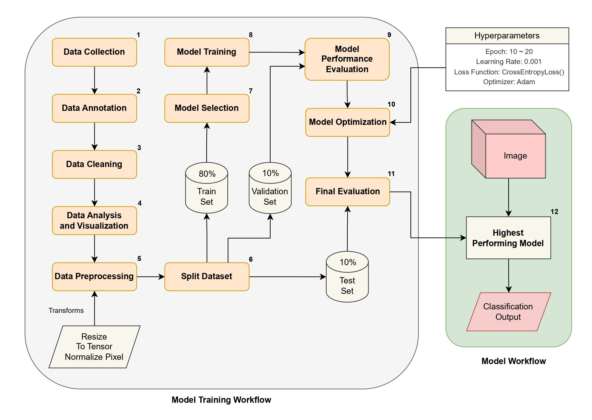

# Smart Waste Sorting System using Image Processing

## Description
With the global population rising and environmental issues becoming increasingly pressing, efficient waste management has become a significant challenge. The Smart Waste Sorting System presents an innovative approach to tackling this problem by employing advanced machine learning and computer vision technologies. The project is centered on automating the sorting of waste into three main categories: recyclable, compostable, and landfill.

The system incorporates various sophisticated Convolutional Neural Networks (CNNs), as detailed in the design and algorithm section, including ResNet50, MobileNet V3 (Large & Small), EfficientNet B0, and MobileNet V2, all implemented using the PyTorch framework. These models are trained on a comprehensive dataset sourced from Kaggle, as discussed in the dataset section, offering a wide range of images representing different waste types. To optimize model performance, the Adam Optimizer, described in the optimization techniques section, is applied to dynamically adjust learning rates, enhancing both accuracy and training speed. The training process is designed to minimize cross-entropy loss, ensuring high precision in waste classification.

## Methodology

### Specifications of Software Block Diagram using ML:

### Simulation of different categories of waste materials:

